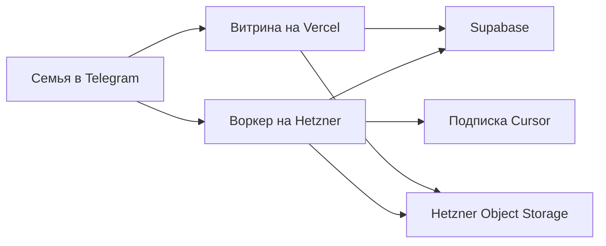

# Архитектура

Семья пишет боту в Telegram. Воркер на VPS запускает Cursor CLI и пишет результат в Supabase. Витрина проекта — отдельный сайт, она читает те же таблицы.

## Воркер

Процесс Node.js на VPS в EU. Systemd поднимает его при старте машины и после падения. Входящий порт только SSH. Наружу воркер ходит сам: Telegram long poll, Supabase, Cursor и GitHub.

Один прогон за раз. Пока агент занят, бот просит подождать. Это флаг в процессе, не выбор самой старой строки из базы. Задача из Telegram сразу пишется в `agent_jobs` и выполняется. Поле `not_before` в таблице есть, отложенный забор из очереди не включён.

Адаптер — Cursor CLI `agent`, не отдельный SDK-процесс. Ключ `CURSOR_API_KEY` тратит лимиты подписки. Модель не зафиксирована: в конфиге стоит Auto, имя модели прогона пишется в `agent_jobs.model`. Инференс облачный.

На сообщение в теме воркер открывает репозиторий проекта в `/var/lib/ai-family/repos/`. Перед запуском делает `git pull`. Агент работает в этой копии. Если в чате прямо попросили изменить витрину, он может поправить код, закоммитить и отправить в `main`. Сайт после этого выкладывается сам. Разбор объявления код не меняет.

Контекст диалога — чат Cursor. Личный чат и каждая тема группы хранятся отдельным файлом в `/var/lib/ai-family/chats/`. Вложения из Telegram скачиваются в `inbox/` этой рабочей копии, агент их читает. В git эта папка не попадает.

## Данные

Supabase в EU, проект во Франкфурте. Воркер ходит туда ключом service role. В браузер этот ключ не попадает.

Сейчас в базе:

- `conversations` — личный диалог или тема Telegram;
- `agent_jobs` — задача, ответ, ошибка и модель;
- `projects` — семейный проект и его репозиторий;
- `listings` и `listing_photos` — карточки квартир и кадры.

RLS включён, политик для посетителей нет. Витрина читает таблицы своим серверным ключом. Вход через Google и членство в проекте не сделаны.

Фото не лежат в Supabase Storage и не на диске воркера. Они в бакете Hetzner Object Storage. Витрина показывает их по временной ссылке.

## Витрина

Сайт проекта — Next.js в репозитории этого проекта, не в `ai-family`. Для Белграда это приватный `ai-family-belgrade-apartments`, хостинг Vercel. Страница каталога открывается только по `/p/<секрет>`. Карточки разложены по четырём категориям: под сдачу, для жизни, дома, новостройки. Пуш в `main` этого репозитория сам выкладывает сайт.

Общего семейного сайта с админкой в этом репозитории нет.
