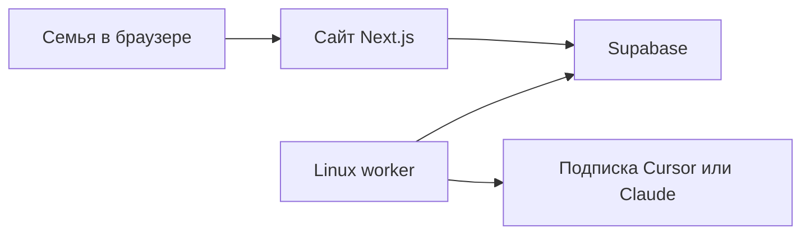

# Архитектура

Система из трёх частей. Сайт и данные живут отдельно от машины, которая гоняет бота.

Семья ходит только в браузер. Linux-клиент — серверный адаптер к подписке, не приложение, которое ставят родственники.

## Web

Один Next.js-проект. У каждого семейного проекта свой маршрут и свой интерфейс. Общие экраны — вход, админка доступа, форма запроса к боту.

Хостинг сайта — отдельное решение. Vercel удобен, но не обязателен: он не запускает клиент подписки. Варианты хостинга — в [ресурсах](resources.md).

## Данные

Supabase: Auth, Postgres, Storage, Realtime. Регион EU.

Доступ к строкам только через RLS по членству в проекте. Supabase есть в любой схеме размещения сайта. Заменить им воркер нельзя: там нет долгоживущего процесса с клиентом подписки.

## Worker

Долгоживущий процесс Node.js на маленьком VPS в EU. Systemd поднимает его при старте машины и после падения. Это программа с циклом: забрать одну строку очереди, открыть репозиторий проекта, прогнать шаг через Cursor SDK, записать результат обратно.

Пока процесс не запущен, сайт и данные живут. Задачи ждут в очереди.

Входящие порты на машине воркера не открываем. Воркер сам опрашивает Supabase по исходящему HTTPS.

Инференс идёт на серверах Cursor или Anthropic. «Local» у Cursor SDK значит, что цикл агента и файлы живут на этой машине, а модель всё равно облачная. Локальная видеокарта не нужна.

## Бот без отдельного API-счёта

«Не через API» значит: не заводить отдельный биллинг OpenAI или Anthropic. Программный ключ, который тратит уже оплаченную подписку, — нормальный путь.

Адаптер один на всех: задание из очереди на входе, текст и статус на выходе. Смена Cursor на Claude не меняет сайт и схему доступа.

Первый адаптер — Cursor SDK, local runtime. Ключ `CURSOR_API_KEY` с дашборда Cursor, расход идёт в лимиты подписки.

Второй адаптер, когда понадобится — Claude Code CLI (`claude -p`) под подпиской Claude. Подписка подключается токеном `claude setup-token` (`CLAUDE_CODE_OAUTH_TOKEN`). Флаг `--bare` подписку не использует: ему нужен отдельный API-ключ, поэтому в эту схему он не входит.

ChatGPT Plus в первую версию не берём. У Codex CLI есть headless-режим `codex exec`, но отдельным адаптером его пока не подключаем. Автоматизация сайта chatgpt.com в архитектуру не входит.

Одна очередь, один прогон за раз. Потолок задаёт подписка, не число ядер. Задачи короткие, отдельного приоритета нет. Воркер берёт самую старую строку, у которой наступило `not_before`. Задача человека создаётся с текущим временем. Шаги пайплайна, которым рано выполняться, лежат в той же таблице с будущим `not_before`.

Отмена ставит статус `cancelled`. Контекст шага, длительность и ссылки на артефакты остаются в строке, файлы — в Storage. Строка в `running` дольше получаса после рестарта снова становится свободной.

Секреты живут только на машине воркера: ключ Cursor или токен Claude и service role Supabase. В браузер и в git они не попадают.

## Проекты и доступ

Сайт — одно Next.js-приложение в этом репозитории. Пайплайн проекта живёт в своём репозитории: указания агенту, шаги и код или статика артефакта. Репозиторий проекта может быть публичным или приватным. Воркер открывает его на время задания. Строка очереди называет проект и шаг, агент сам проект не выбирает.

Общие таблицы:

- `projects` — семейные проекты и ссылка на их репозиторий;
- `project_members` — кто и с какой ролью видит проект;
- `agent_jobs` — очередь всех задач, включая отложенные.

У каждого проекта свои таблицы и бакет. Везде есть `project_id` и RLS.

Примеры пайплайнов:

- квартира для аренды;
- автомобиль для покупки или зимняя резина;
- институт для сына;
- подготовка к регате.

Админ в вебе отмечает, какому Google-аккаунту какие проекты видны. Первый админ — allowlist email владельца. Вход — Google через Supabase Auth.

Яндекс возможен позже как отдельный OIDC-провайдер. В первую версию не входит: у Supabase Google уже штатный, Яндекс пришлось бы подключать самим.
